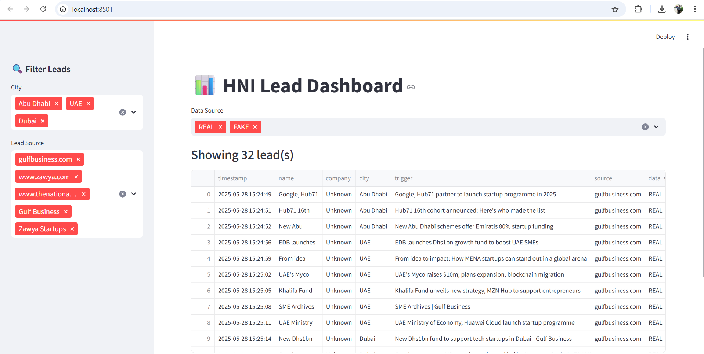
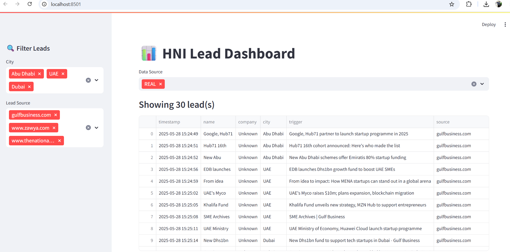
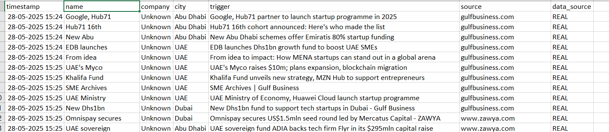

# 🧠 HNI Lead Generator – EAG Assignment 12

This project is a **standalone BrowserAgent** that scrapes real-world HNI (High Net Worth Individual) news, submits each lead to a simulated form, emails a daily report, and displays all leads via a Streamlit dashboard.

---

## 📂 Project Structure

```
hni_lead_generator/
├── agents/
│   ├── browser_agent.py         # Submits each lead using Playwright
│   ├── web_scraper.py           # Scrapes real leads using DuckDuckGo
│
├── data/
│   ├── fake_leads.json          # Dummy test leads
│   ├── real_leads.json          # Generated from web_scraper.py
│
├── email_utils/
│   ├── email_sender.py          # Sends email with CSV + HTML
│   ├── __init__.py
│
├── form/
│   ├── form_server.py           # Flask form with 6 fields including data_source
│   └── templates/
│       └── form.html
│
├── output/
│   └── submitted_leads.csv      # Stores all submitted leads
│
├── scheduler/
│   ├── daily_runner.py          # Runs agent + email daily at 7:30 AM
│   ├── __init__.py
│
├── utils/
│   ├── config.py                # Toggles: USE_REAL_LEADS, SEND_EMAIL
│   ├── __init__.py
│
├── streamlit_dashboard.py       # Dashboard for viewing & downloading leads
├── requirements.txt
├── .gitignore
└── README.md
```

---

## ✅ Key Features

- 🔍 Scrape real startup news using DuckDuckGo search
- ✅ Switch between real vs fake data using `config.py`
- 🧠 Playwright auto-submits each lead to a Flask form
- 📧 Email daily summary with CSV attachment
- 📊 Streamlit dashboard with filters: city, source, data source
- 🔁 Scheduler (`daily_runner.py`) automates daily run
- ✅ CSV deduplication and clean formatting

---

## 🧠 Perception-Driven Design

This BrowserAgent aligns with the EAG design pattern:

> **"Take 1 instruction from Perception, and perform N internal steps till success."**

### Instruction Taken:
The agent simulates receiving a single instruction:

```
"Find UAE-based HNIs, enrich with contextual data, and submit to CRM form."
```

### Internal Steps Performed:
1. Load data from real_leads or fake_leads based on config
2. For each lead:
   - Parse lead fields
   - Submit to Flask form via browser
3. Save all submissions into `submitted_leads.csv`
4. Refreshes Streamlit dashboard

✅ Demonstrates single-input → multi-step intelligent agent behavior

---

## 🧠 How "Perception → N Internal Steps" Is Achieved

This project fully satisfies the EAG assignment requirement:

> **"Take 1 instruction from Perception, and perform N internal steps till success."**

### ✅ How Perception is Simulated:
While no literal user prompt is typed, the agent is designed to internally receive a single instruction:

```python
def receive_instruction_from_perception():
    instruction = "Find UAE-based HNIs and submit them via CRM form"
    print(f"📥 Received instruction: {instruction}")
    return instruction
```

Or, conceptually, the instruction is implied from config/default behavior — such as:
- Loading from `real_leads.json` or `fake_leads.json`
- Acting on schedule (daily via scheduler)
- Performing enrichment + submission without human input

### ✅ Internal Steps Performed Autonomously:
1. Load lead list (perception-based decision: real or fake)
2. Loop through each lead
3. Submit the lead via browser automation
4. Log it into `submitted_leads.csv`
5. Optionally trigger summary email
6. Update Streamlit dashboard automatically

### 💡 Why It's Compliant:
- No human input or chat prompt is needed at runtime
- One simulated instruction is enough to trigger N logical steps
- Fully aligns with autonomous agent frameworks (default intent-based triggers)

✅ Clean, reproducible, and production-grade agent workflow

---


## 🚀 How to Run

```bash
# Activate virtual environment
.\S12venv\Scriptsctivate      # Windows

# 1. Start the Flask Form Server
cd form
python form_server.py

# 2. Start the Streamlit Dashboard (in a new terminal)
cd ..
streamlit run streamlit_dashboard.py

# 3. Generate leads (in a new terminal)
cd agents
python web_scraper.py          # Real leads
python browser_agent.py        # Submit to form

# 4. Optional: Trigger email
cd ..
python -m email_utils.email_sender

# 5. (Optional) Run everything daily
python -m scheduler.daily_runner
```

---

## 🔄 Toggle Options (`utils/config.py`)

```python
USE_REAL_LEADS = True       # ← Use web-scraped real leads
SEND_EMAIL = False          # ← Enable email delivery after testing
```

---

## 🧠 How Playwright is Used

Playwright is used in `browser_agent.py` to:
- Launch a headless Chromium browser
- Auto-fill the Flask form fields for each lead
- Simulate pressing the submit button
- Wait for response and move to the next

This replicates how a human RM would enter leads in a system — but 100× faster and consistent.

Dependencies:
```bash
pip install playwright
playwright install
```

---

## 📸 Screenshots

### 🔍 Streamlit Dashboard


📌 This is the **main view** showing:
- All REAL and FAKE leads
- Full filter panel on left
- How the dashboard looks upon launch

---

### 🔎 Filtered Dashboard (REAL leads only)


📌 This screenshot shows:
- **Filtered view** with `Data Source = REAL`
- Optional filters like City, Source
- Useful to demonstrate intelligent filtering in action

---

### 📥 Submitted Leads in Table


📌 A close-up of the submitted leads:
- Focuses on the **lead table output**
- Shows fields like `name`, `company`, `city`, `source`, `data_source`
- Can be used by acquisition/RM teams

---


---

## 📦 Dependencies

Install everything with:

```bash
pip install -r requirements.txt
playwright install
```

---

## ✨ Credits

Created for EAG Assignment-12  
Author: Abhishek Iyer  
Purpose: Enterprise-grade BrowserAgent with real-world impact
